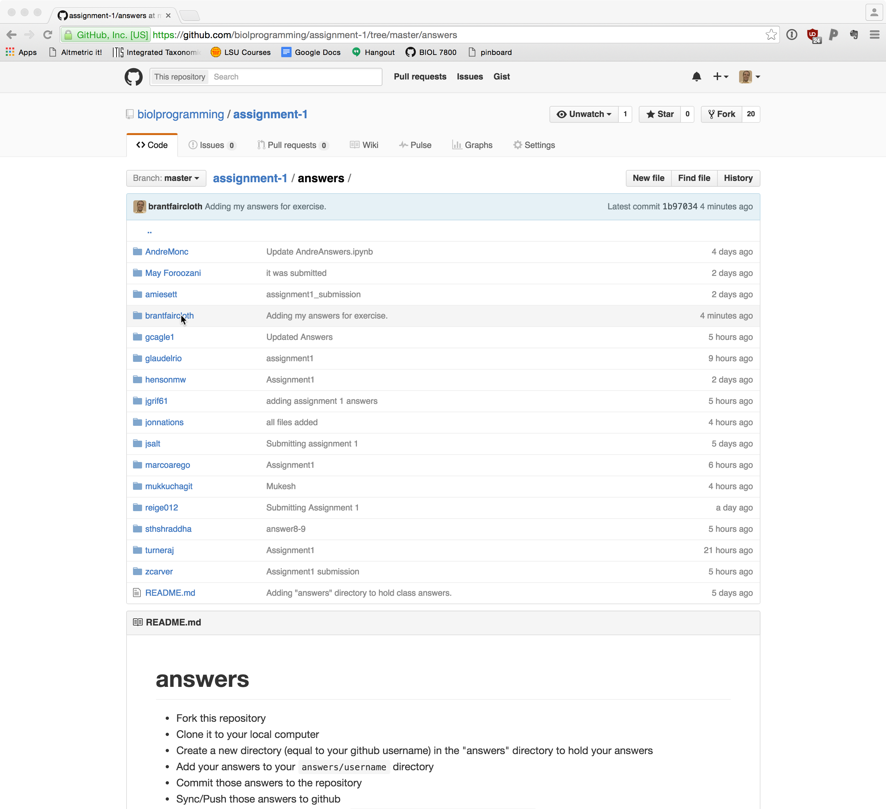
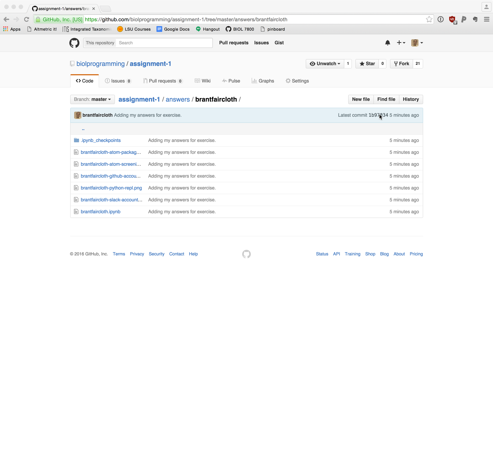
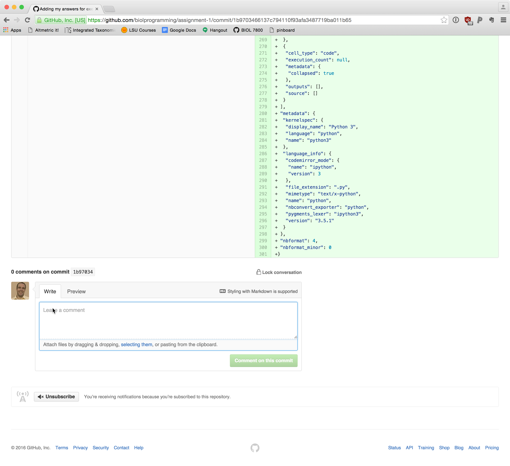
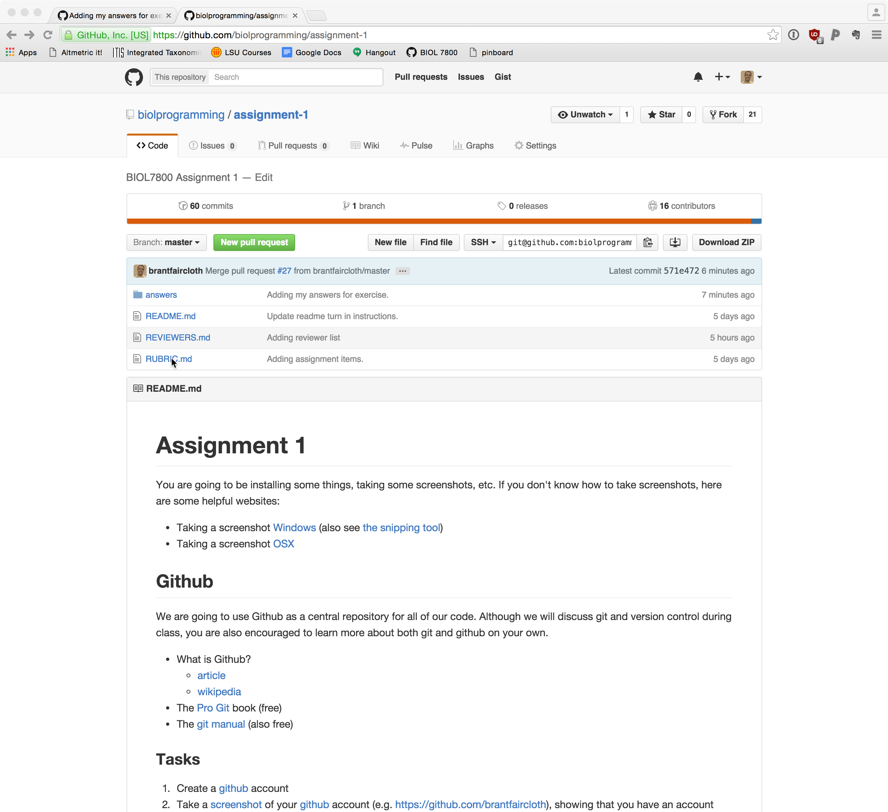
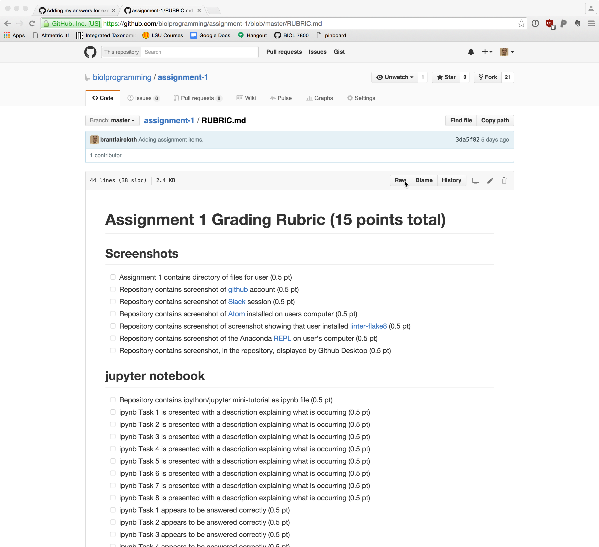
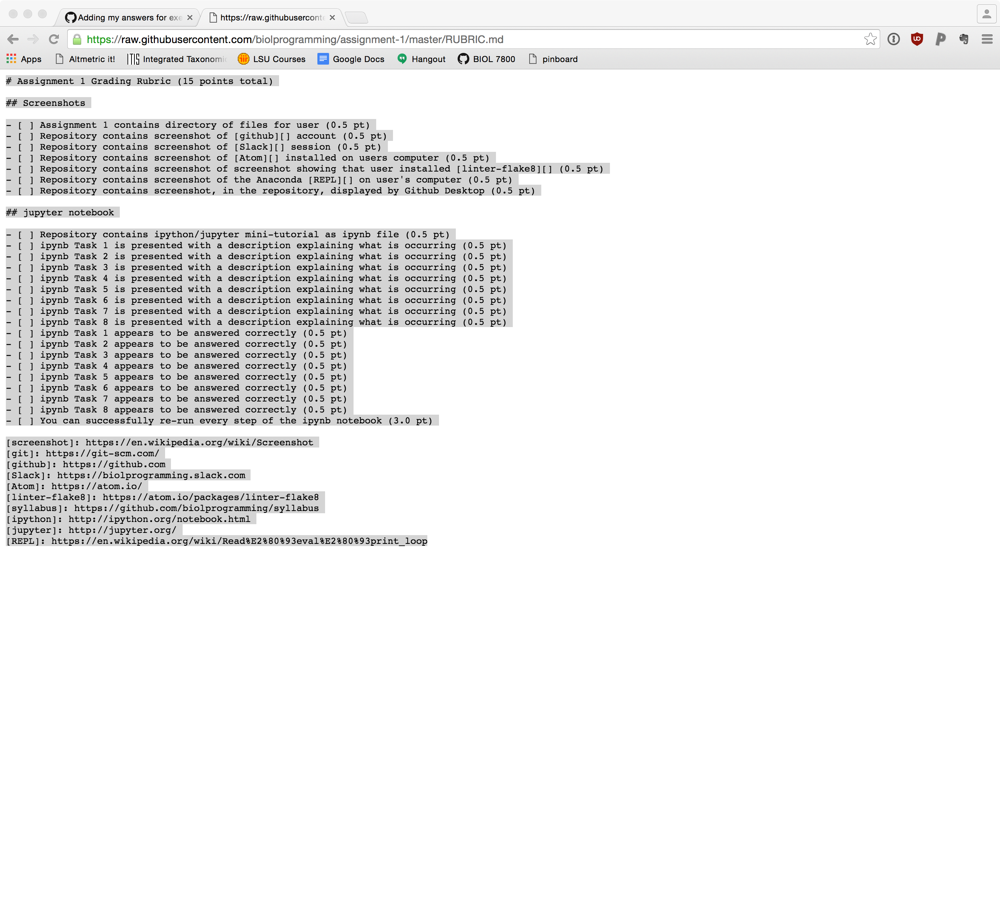
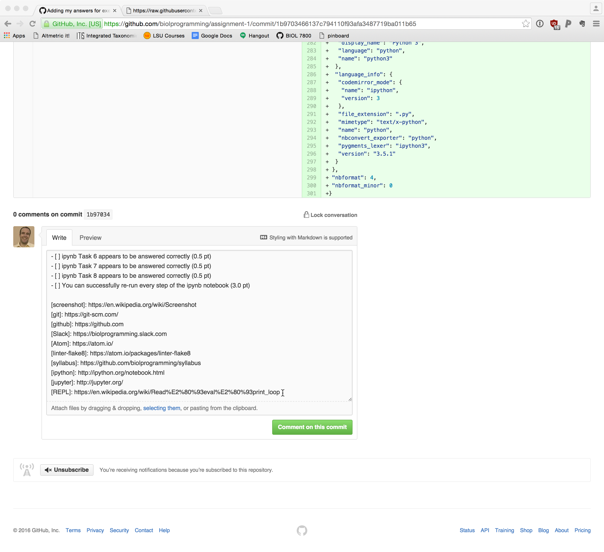
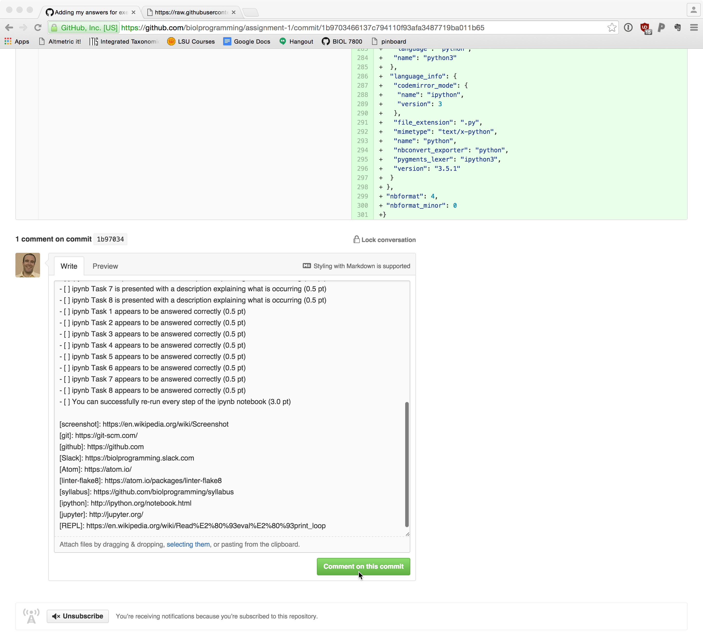
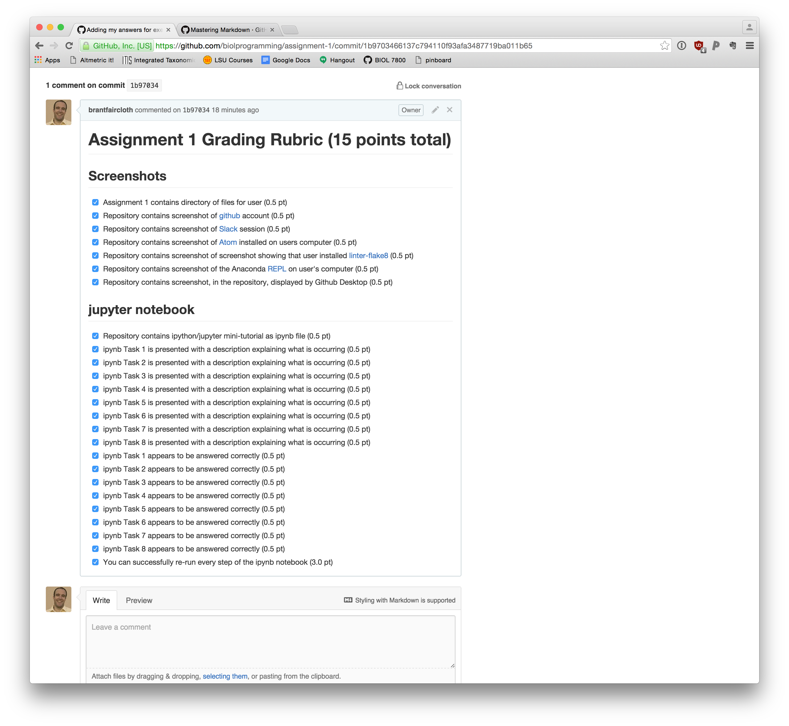

# Code review for Assignment 1

Assignment|Reviewer 1|Reviewer 2
----------|----------|----------
Zac Carver|Jessie Salter|Marco Rego
Jessie Salter|Marco Rego|Mukesh Maharjan
Marco Rego|Mukesh Maharjan|Andre Moncrieff
Mukesh Maharjan|Andre Moncrieff|Elisa Elizondo
Andre Moncrieff|Elisa Elizondo|Pramod Pantha
Elisa Elizondo|Pramod Pantha|Corey Bretz
Pramod Pantha|Corey Bretz|Maryam Foroozani
Corey Bretz|Maryam Foroozani|Grace Cagle
Maryam Foroozani|Grace Cagle|Alicia Reigel
Grace Cagle|Alicia Reigel|Jon Nations
Alicia Reigel|Jon Nations|Amie Settlecowski
Jon Nations|Amie Settlecowski|AJ Turner
Amie Settlecowski|AJ Turner|Uttam Bhattarai
AJ Turner|Uttam Bhattarai|Michael Henson
Uttam Bhattarai|Michael Henson|Austen Webber
Michael Henson|Austen Webber|Glaucia Del-Rio
Austen Webber|Glaucia Del-Rio|Zac Carver
Glaucia Del-Rio|Zac Carver|Jessie Salter

# How to perform your code review

* On [github](https://github.com), go to the folder of the person whose code you are reviewing.  Note that I have included the pointer arrow in these screenshots to show you what, exactly, to click on:

    

* Once you are in their folder, click on the "commit hash" in the upper right hand corner (`1b97034` in this example):

    

* Scroll down to the very bottom of the page.  You will see a comment box:

    

* Now, in a new broswer tab, open up the [RUBRIC.md](https://github.com/biolprogramming/assignment-1/blob/master/RUBRIC.md) for [assignment-1](https://github.com/biolprogramming/assignment-1):

    

* We're going to copy the raw text of this file (not the part that github has rendered to make it pretty).  Click on the `Raw` button:

    

* Clicking on the `Raw` button will take you to the raw text.  Copy that raw text:

    

* After copying that text, return to the first browser tab, which should be at the bottom of the submission you are grading. Paste the text into this box that you copied:

    

* Click the `Comment on this commit` to render the text you pasted into check boxes.

    

* Work through the code that you are grading, making sure that the answers are correct **according to the RUBRIC.md**.  You may even need to update your copy of the cloned assignment-1 directory so that you can check the code you are grading.  **If you don't understand how something is working, it's best to test it - it might not be correct**:

    

* You are finished.  Proceed to your 2nd code review.
